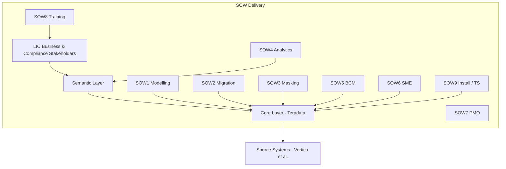
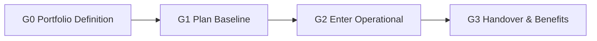

# Program Charter · {{ project.name }}

| Field | Value |
|-------|-------|
| Program ID | {{ project.id }} |
| Type | {{ project.type }} |
| Methodology | {{ project.methodology }} |
| Sponsor | {{ program.sponsor }} |
| Program Manager | {{ program.manager }} |
| Start | {{ program.start }} |
| Target End | {{ program.target_end }} |
| Domain | {{ program.domain }} |

### Program Architecture (mermaid)
> SOW delivery structure: each SOW attaches to the Core/Semantic layer. Note: mermaid forbids an edge from a node to its own enclosing subgraph, so SOW6/SOW7 now point to CORE/LIC instead of self-referencing DELIVERY.

## 1. Business Case
{{ program.business_case }}

## 2. Program Objectives
{{#each program.objectives}}
- {{this}}
{{/each}}

## 3. Scope
{{ program.scope }}

## 4. Out of Scope
{{ program.out_of_scope }}

## 5. Financials & Commercial Model
> Each SOW fee comes from `program.sows[].fee` (contract-locked value); when not locked, state "TBC + reason" — do not leave the whole table as (TBD).

| SOW | Workstream | Commercial Model | Billing Basis | Fee |
|-----|------------|------------------|---------------|-----|
{{#each program.sows}}
| {{this.sow}} | {{this.workstream}} | {{this.model}} | {{this.billing}} | {{this.fee}} |
{{/each}}

- **Total program effort (planning baseline):** {{ program.effort_total }}
- **Budget governance:** {{ program.budget_governance }}
- **Cost-risk exposure:** {{ program.cost_risk }}

> Fee rollup: sum of `program.sows[].fee` should be ≤ total budget (BAC); the remainder is in-house / management overhead.

## 6. Governance & Stage Gates
{{#each program.gates}}
- **{{this.id}}** {{this.name}}
{{/each}}

Cadence: {{ program.cadence }}

## 7. Key Risks (see `risks/risk_register.md`)
{{ program.key_risks }}

## 8. Success Criteria
{{ program.success_criteria }}

## Contract Boundaries & Subcontracting (Contract / Extract / SOW)
{{#each program.contracts}}
- Contract {{this.code}} ({{this.type}}): {{this.scope}} | Vendor {{this.vendor}} | Fee {{this.fee}} | Status {{this.status}} | Linked {{this.sow}}
{{/each}}
{{#each program.extracts}}
- Extract {{this.id}}: {{this.scope}} ({{this.mode}}, linked {{this.contract}})
{{/each}}

## Sign-off
| Role | Name | Date | Signature |
|------|------|------|-----------|
| Sponsor |  |  |  |
| Program Manager |  |  |  |
| Governance Board Chair |  |  |  |
